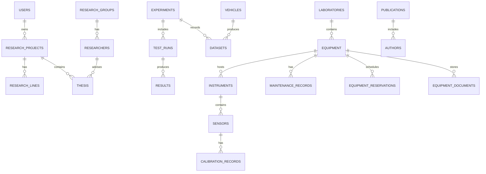

# Modelo de Datos - BCELP

Este documento describe las entidades principales del dominio de investigación, laboratorio y electromovilidad.

Entidades principales

- User: cuentas de usuario del sistema.
- Role: roles (p. ej. admin, researcher).
- Permission: permisos asignables a roles.
- ResearchProject: proyecto de investigación (nombre, descripción, owner).
- Thesis: tesis asociada a un proyecto y estudiante.
- Student: datos de estudiantes.
- Laboratory: laboratorio físico o virtual.
- Equipment: equipos del laboratorio.
 - Instrument: instrumentos instalados en equipos (p. ej. data acquisition modules).
 - Sensor: sensores conectados a instrumentos.
 - CalibrationRecord: registros de calibración para sensores.
 - MaintenanceRecord: historial de mantenimiento de equipos.
 - EquipmentReservation: reservas de uso de equipos.
 - EquipmentDocument: documentos asociados a un equipo (manuales, certificaciones).
- Vehicle: vehículos sobre los que se realizan pruebas.
- Battery: celdas, packs y BMS.
- Experiment: experimento o campaña de pruebas.
- Dataset: archivos y metadatos asociados a experimentos o tests.
- TestRun: ejecución de una prueba concreta (parámetros, timestamps).
- Result: resultados derivados de un TestRun (valores, métricas).
- Report: informes generados (referencia a datasets, results).
- Publication: artículos y publicaciones

Relaciones principales

- `User (1) -- (N) ResearchProject` via `owner_id`.
- `ResearchProject (1) -- (N) Experiment`.
- `Experiment (1) -- (N) TestRun`.
- `TestRun (1) -- (N) Result`.
- `Experiment (1) -- (N) Dataset`.
- `Laboratory (1) -- (N) Equipment`.
- `Vehicle (1) -- (N) Dataset`.
- `ResearchProject (1) -- (N) Thesis`.
- `Student (1) -- (1) Thesis`.
- `Role <-> User` many-to-many via `user_roles`.
- `Role <-> Permission` many-to-many via `role_permissions`.

Consideraciones

- Claves primarias UUID para entidades principales (seguimos SQLAlchemy mixins existentes).
- Campos JSON para metadata y parámetros experimentales.
- Soft delete con `is_deleted`/`deleted_at` para preservar historial.
- La integración con IA debe ser opcional: cualquier campo/modelo relacionado con IA será claramente marcado y no obligatorio.

Archivos relevantes

- Modelos SQLAlchemy: `backend/app/models/`
- Endpoints CRUD (ejemplos): `backend/app/api/projects.py`, `backend/app/api/labs.py`

Cómo probar

1. Levantar el entorno (Docker Compose preferido):

```bash
cd backend
docker compose up --build
```

2. Usar las rutas CRUD:

- `GET /projects/`, `POST /projects/`, `GET /projects/{id}`, `PUT /projects/{id}`, `DELETE /projects/{id}`
- `GET /labs/`, `POST /labs/`, `GET /labs/{id}`, `PUT /labs/{id}`, `DELETE /labs/{id}`

3. Los tests básicos están en `backend/app/tests/`.

## Diagrama ER (Mermaid)



## Decisiones de diseño

- Uso de `UUID` como PK en entidades principales para facilitar distribución y referencias externas.
- Campos `JSON` para `metadata` y `parameters` en `Experiment`, `Dataset` y `TestRun` para flexibilidad de datos experimentales.
- `SoftDeleteMixin` en todas las entidades para preservar historial y posibilitar auditoría.
- Modelos relacionados con IA (p. ej. `ai_insights`) no están presentes por defecto; se añadirá como una tabla opcional si se requiere.
- Mantener modelos y schemas separados: SQLAlchemy en `backend/app/models/` y Pydantic en `backend/app/schemas/`.

Si quieres, genero también un diagrama visual exportable o añado campos adicionales por entidad.
