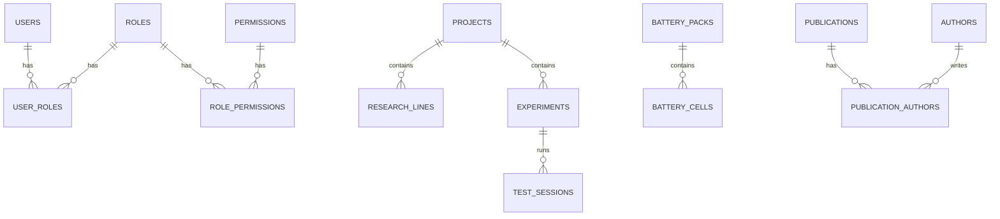

# BCELP ERD (Entity Relationship Diagram)

This file provides a high-level ERD description for BCELP. Use any visual tool (dbdiagram.io, draw.io, Mermaid) to render these relationships.

Entities (abbreviated):

- users (1) ---< user_roles >--- (M) roles
- roles (1) ---< role_permissions >--- (M) permissions

- projects (1) ---< research_lines (M)
- projects (1) ---< experiments (M)
- projects (1) ---< theses (M)

- experiments (1) ---< test_sessions (M)
- experiments (1) ---< battery_records (M)

- battery_packs (1) ---< battery_cells (M)
- battery_packs (1) ---< bms (M)

- publications (1) ---< publication_authors >--- (M) authors

- vehicles (1) ---< vbox_files, obd_files

Notes:
- All primary keys are UUIDs.
- Most relationships are one-to-many; association tables are used for many-to-many (users-roles, roles-permissions, publications-authors).

Suggested Mermaid snippet you can paste into a renderer:

